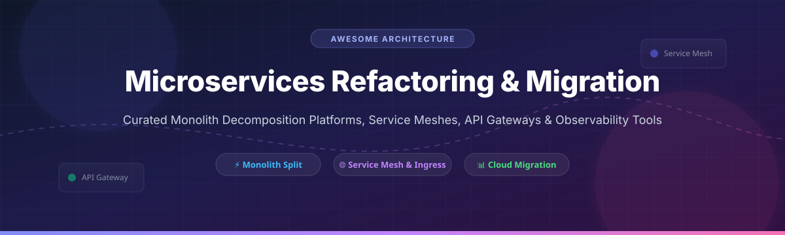

# Awesome Microservices Refactoring & Migration 🚀

  
  
  
  

## 💡 Top Microservices Refactoring & Migration Ecosystem

**Curated List of Enterprise SaaS Platforms & Open-Source GitHub Projects**

*Focused on Monolith Decomposition, Microservices Extraction, API Gateways, Service Mesh & Cloud Migration Platforms*

**Last updated: October 2026**

This repository tracks notable **commercial microservices refactoring platforms** and **open-source software** that empower software architects and platform engineers to decompose legacy monoliths, extract distributed microservices, and manage service-to-service communication — covering automated refactoring tools, API gateways, distributed observability, and service meshes.

---

## 📑 Table of Contents
- [SaaS & Enterprise Platforms](#-saas--enterprise-platforms)
- [Open-Source GitHub Projects](#-open-source-github-projects)
  - [API Gateways & Ingress](#api-gateways--ingress)
  - [Microservices Frameworks](#microservices-frameworks)
  - [Service Mesh](#service-mesh)
  - [Observability & Tracing](#observability--tracing)
  - [Developer Tooling & Cloud Management](#developer-tooling--cloud-management)
  - [Database Schema Migration](#database-schema-migration)
- [Star History](#-star-history)
- [Support & Community](#-support--community)
- [How to Contribute](#-how-to-contribute)
- [Disclaimer](#-disclaimer)

---

## 🏢 SaaS & Enterprise Platforms

> **Market Insights:** The global cloud migration and application modernization market size is estimated at **$18.5 Billion to $25.0 Billion** (growing at ~22% CAGR). The market is **moderately fragmented**, led by public cloud hyper-scalers (AWS, Microsoft, Google Cloud) alongside specialized SaaS modernization engines (vFunction, CAST Imaging) and enterprise platform vendors (Red Hat, Cisco/AppDynamics).

| Enterprise Platform | Size / Valuation / Revenue | Starting Price | Free Tier / Trial Limit | Key Description & Focus |
| :--- | :--- | :--- | :--- | :--- |
| **[Red Hat OpenShift](https://www.redhat.com/en/technologies/cloud-computing/openshift)** | **~$34.0 Billion** (Red Hat division of IBM) | $0.08 per vCPU hour / $700 annually per vCPU pair | 60-day free trial on Red Hat OpenShift Service on AWS / Azure | Enterprise Kubernetes ecosystem with Migration Toolkit for Applications (MTA) to assist Java & monolith modernization. |
| **[AppDynamics](https://www.appdynamics.com/)** | **~$3.7 Billion** (Acquired by Cisco) | $60.00 / month per CPU core (Infrastructure Monitoring) | 15-day free trial with unlimited agent capabilities | Application performance monitoring (APM) and dynamic topology mapping to pinpoint monolithic bottlenecks. |
| **[Dynatrace](https://www.dynatrace.com/)** | **~$15.0 Billion** Valuation ($1.4B ARR) | $0.08 / hour per host (Full-Stack Monitoring, 8GB host) | 15-day free trial with 1,000 hour monitoring quota | AI-powered observability platform (Smartscape) mapping monolith component dependencies for microservice isolation. |
| **[AWS Migration Hub Refactor Spaces](https://aws.amazon.com/migration-hub/refactor-spaces/)** | **~$100.0+ Billion** (AWS division of Amazon) | $0.028 per environment / hour | 3 months free (up to 2,160 environment hours & 500,000 API requests/month) | AWS incremental refactoring service utilizing Strangler Fig pattern for side-by-side microservice extraction. |
| **[CAST Imaging](https://www.castsoftware.com/)** | **~$150.0 Million** Revenue | $2,100.00 / year (Express Tier) | 30-day free trial (CAST Imaging Express) / 12 months free for universities | Software intelligence engine visualising code dependencies and architectural boundaries across multi-million line monoliths. |
| **[Kong Gateway (Enterprise)](https://konghq.com/)** | **~$1.4 Billion** Valuation ($100M+ ARR) | $250.00 / month (Plus Plan) | Free tier available (Kong Konnect Free Plan with 5 service instances & basic routing) | Enterprise API Gateway and service connectivity platform with governance, traffic control, and microservice routing. |
| **[Solo.io Gloo Mesh](https://www.solo.io/)** | **~$1.0 Billion** Valuation ($15M ARR) | $1,500.00 / cluster / month (Base tier quote) | 30-day enterprise evaluation license + free self-paced interactive hands-on labs | Enterprise Istio & Envoy management mesh for multi-cluster microservice orchestration and security. |
| **[vFunction](https://vfunction.com/)** | **~$150.0 Million** Valuation ($39.8M Funding) | $5,000.00 / application / year | Free 1-year Assessment Hub Express for up to 3 applications | AI-driven architectural observability platform that automates Java and .NET monolith refactoring into domain microservices. |

---

## 🛠️ Open-Source GitHub Projects

### API Gateways & Ingress

- **[Traefik](https://github.com/traefik/traefik)**  🌟 **65,098 stars**  
  *Cloud-native reverse proxy and ingress controller*. Features automatic service discovery, dynamic routing, and built-in TLS termination. Ideal for Kubernetes microservice ingress.

- **[Kong Gateway (OSS)](https://github.com/Kong/kong)**  🌟 **44,248 stars**  
  *Cloud-native Lua/OpenResty API gateway*. High-performance API routing, plugin ecosystem (rate-limiting, auth, logging), and service discovery.

- **[Apache APISIX](https://github.com/apache/apisix)**  🌟 **17,201 stars**  
  *Dynamic high-performance API gateway*. Supports hot-reloading plugins, dynamic routing, traffic splitting, and OpenTelemetry tracing.

- **[Tyk](https://github.com/TykTechnologies/tyk)**  🌟 **10,854 stars**  
  *Open-source API gateway & management platform*. Includes developer portals, rate limiting, and detailed analytics written in Go.

- **[Envoy Gateway](https://github.com/envoyproxy/gateway)**  🌟 **3,070 stars**  
  *Kubernetes-native API Gateway powered by Envoy*. Official Gateway API controller for managing ingress traffic in cloud-native environments.

- **[KrakenD](https://github.com/krakend/krakend-ce)**  🌟 **2,690 stars**  
  *Ultra-fast stateless API gateway*. Focuses on microservice aggregation, payload transformation, and high-throughput backend decoupling.

---

### Microservices Frameworks

- **[NestJS](https://github.com/nestjs/nest)**  🌟 **76,797 stars**  
  *Progressive Node.js framework built with TypeScript*. Perfect for structuring modular monoliths or building decoupled microservices with gRPC and MQTT.

- **[Spring Framework / Cloud](https://github.com/spring-projects/spring-framework)**  🌟 **60,276 stars**  
  *The standard Java application framework*. Comprehensive cloud primitives for service discovery, externalized configuration, circuit breakers, and API gateways.

- **[Go Kit](https://github.com/go-kit/kit)**  🌟 **27,424 stars**  
  *Programming toolkit for building microservices in Go*. Provides RPC transport, logging, metrics, and circuit-breaking abstractions.

- **[Dapr](https://github.com/dapr/dapr)**  🌟 **26,131 stars**  
  *Distributed Application Runtime*. Provides portable sidecar APIs for state management, pub/sub, service invocation, and workflow execution.

- **[Go Micro](https://github.com/micro/go-micro)**  🌟 **23,087 stars**  
  *Distributed systems development framework for Go*. Includes pluggable service discovery, message encoding, and synchronous/asynchronous communication.

---

### Service Mesh

- **[Istio](https://github.com/istio/istio)**  🌟 **38,426 stars**  
  *The industry-standard open-source service mesh*. Manages mTLS encryption, traffic routing, fault injection, and telemetry without changing application code.

- **[HashiCorp Consul](https://github.com/hashicorp/consul)**  🌟 **30,095 stars**  
  *Service networking solution for service discovery and mesh*. Provides multi-cloud service registration, health checking, and network segmentation.

- **[Cilium](https://github.com/cilium/cilium)**  🌟 **25,613 stars**  
  *eBPF-powered network connectivity, observability, and security*. Enables sidecarless service mesh and kernel-level network performance for Kubernetes.

- **[Linkerd2](https://github.com/linkerd/linkerd2)**  🌟 **11,507 stars**  
  *Ultra-lightweight Rust-based service mesh*. CNCF graduated project prioritizing minimal CPU/memory overhead and effortless operational simplicity.

- **[Kuma](https://github.com/kumahq/kuma)**  🌟 **4,011 stars**  
  *Universal control plane for Envoy service mesh*. Designed for cross-zone multi-cluster enterprise mesh deployments on Kubernetes and VMs.

- **[Kiali](https://github.com/kiali/kiali)**  🌟 **3,641 stars**  
  *Observability console for Istio service mesh*. Generates real-time service topology maps, traffic flows, and mTLS security validations.

---

### Observability & Tracing

- **[SigNoz](https://github.com/SigNoz/signoz)**  🌟 **32,303 stars**  
  *Open-source native OpenTelemetry APM platform*. Unifies metrics, logs, and distributed trace visualization in a single dashboard.

- **[Jaeger](https://github.com/jaegertracing/jaeger)**  🌟 **23,269 stars**  
  *CNCF graduated distributed tracing platform*. Pinpoints latency bottlenecks and traces request paths across complex microservice graphs.

- **[Grafana Tempo](https://github.com/grafana/tempo)**  🌟 **5,511 stars**  
  *High-scale, cost-effective trace storage backend*. Integrates seamlessly with Grafana, Prometheus, and Loki for full-stack telemetry.

- **[OpenTelemetry Specification](https://github.com/open-telemetry/opentelemetry-specification)**  🌟 **4,347 stars**  
  *Vendor-neutral observability standard for traces, metrics, and logs*. The foundational telemetry standard for cloud-native applications.

---

### Developer Tooling & Cloud Management

- **[Skaffold](https://github.com/GoogleContainerTools/skaffold)**  🌟 **15,892 stars**  
  *Easy continuous development for Kubernetes*. Automates building, pushing, and deploying microservice pipelines locally or in remote clusters.

- **[Crossplane](https://github.com/crossplane/crossplane)**  🌟 **12,134 stars**  
  *Cloud native control plane framework*. Enables platform teams to assemble custom infrastructure CRDs for provisioning databases and cloud resources.

- **[Tilt](https://github.com/tilt-dev/tilt)**  🌟 **10,091 stars**  
  *Microservice development environment for Kubernetes*. Live-updates container changes in real-time with comprehensive service dashboards.

- **[Telepresence](https://github.com/telepresenceio/telepresence)**  🌟 **7,312 stars**  
  *Fast local dev loop for Kubernetes microservices*. Connects a local developer workstation directly to a remote Kubernetes cluster.

---

### Database Schema Migration

- **[Flyway](https://github.com/flyway/flyway)**  🌟 **10,124 stars**  
  *Version-controlled database migration tool*. Manages schema evolution and data migrations safely across monolithic database splits.

- **[Liquibase](https://github.com/liquibase/liquibase)**  🌟 **5,621 stars**  
  *Database schema change management solution*. Supports SQL, XML, JSON, and YAML formats for CI/CD database deployment tracking.

- **[SchemaHero](https://github.com/schemahero/schemahero)**  🌟 **1,272 stars**  
  *Declarative database schema migration tool for Kubernetes*. Converts declarative YAML table definitions into database migration scripts.

---

## 📈 Star History

---

## 💖 Support & Community

Thank you for exploring the **Awesome Microservices Refactoring & Migration** repository! 

If you find this list helpful for your cloud migration journey or software architecture research:
- ⭐️ **Star** this repository to increase visibility!
- 🔀 **Fork** it to contribute missing platforms and open-source tools!
- 📢 **Share** it with fellow software architects and platform engineers!
- ☕ **Sponsor**: If you'd like to support open-source curation and maintenance, consider buying a coffee via the [Sponsor Dashboard](https://github.com/sponsors/ishandutta2007).

---

## 🤝 How to Contribute

1. Fork the repo.
2. Add or edit entries in `README.md` following the tabular & badge formats.
3. Include product name, official link, stargazers URL, pricing details, and concise descriptions.
4. Submit a Pull Request (PR) with a clear description of the addition.

---

## ⚠️ Disclaimer

- This is a community-curated directory — not an exhaustive list or direct commercial endorsement.
- Monolith decomposition and microservice migration introduce architectural overhead. Always execute migration incrementally via **Strangler Fig**, **Feature Toggles**, and **Circuit Breakers**.
- Evaluate operational requirements before adopting service meshes or complex ingress controllers.

---

  <b>Built for Software Architects, Platform Engineers, and Cloud Modernization Teams 🚀</b> 
  Check out more awesome lists at <a href="https://github.com/ishandutta2007/Awesome-Awesome-Awesome">Awesome-Awesome-Awesome</a>.

